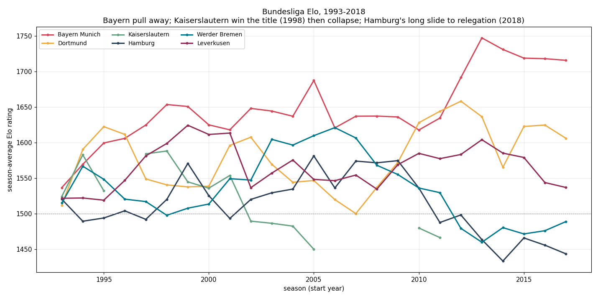
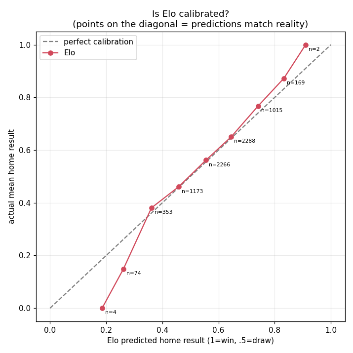

# Bundesliga Elo ratings (1993–2018)

A running Elo rating for every Bundesliga club across 25 seasons — enough
to read the league's history off one chart, and calibrated well enough to
actually forecast matches.

Elo is dead simple: everyone starts at 1500, the winner takes points off
the loser after every match, and the amount depends on how surprising the
result was. Beating a much stronger side moves your rating a lot; beating a
much weaker one barely moves it. That's the whole model.

## 25 years in one chart



Season-average rating for six clubs. The stories are all there:

- **Bayern** are always strong, then pull decisively away from about 2012
  — the Guardiola-era side that peaked at an Elo of ~1750.
- **Dortmund** dip through the mid-2000s (their near-bankruptcy years),
  then surge back with the Klopp title sides around 2011-12.
- **Kaiserslautern** win the title in 1998, then slide and drop out of the
  division entirely (the line breaks where they're relegated).
- **Hamburg**'s long decline runs all the way to their first-ever
  relegation in 2018.

The six strongest single seasons in the entire dataset are all Bayern,
2012-13 through 2017-18 — the ratings put a number on the dynasty:

| team-season | avg Elo |
|---|---:|
| Bayern Munich 2013-14 | 1747 |
| Bayern Munich 2014-15 | 1731 |
| Bayern Munich 2015-16 | 1719 |
| Bayern Munich 2016-17 | 1718 |
| Bayern Munich 2017-18 | 1716 |
| Bayern Munich 2012-13 | 1692 |

## Does it actually predict?

A rating history is only worth plotting if the ratings forecast results.
They do. Bucketing every match by Elo's predicted home result and comparing
to what actually happened, the model sits almost exactly on the diagonal —
when Elo says the home side should take ~65% of the points, they take ~65%:



And the favourite wins about as often as you'd expect in a sport this
draw-heavy (dropping the first season, when ratings are still settling from
the cold 1500 start):

| outcome | rate |
|---|---:|
| Elo favourite wins outright | 49.9% |
| draw | 25.6% |
| underdog wins (upset) | 24.5% |
| *always-home baseline* | *46.8%* |

Half the time the favourite wins, a quarter of the time it's a draw, a
quarter of the time there's an upset — football is not very predictable, and
an honest rating system shouldn't pretend otherwise.

### Biggest upsets

The largest rating gaps where the favourite still lost — almost all Bayern
defeats, because Bayern held by far the biggest edges, so their rare losses
are the biggest surprises. Note how many land on the final matchday, when a
side that has already won the title tends to rest players:

- 2013-14: **Augsburg** beat Bayern Munich (favoured by 286 Elo)
- 2014-15: **Freiburg** beat Bayern Munich (273)
- 2012-13: **Hoffenheim** beat Dortmund (250)
- 2017-18: **Stuttgart** beat Bayern Munich, final day (237)

## A data trap worth knowing about

The results come from football-data.co.uk and need almost no cleaning, with
one exception that would quietly corrupt the ratings. Three "Leipzig"-ish
labels appear, and they are **not** all the same club: `Leipzig` (1993-94)
is VfB Leipzig, relegated and gone; `RB Leipzig` (2016-18) was founded in
2009. Merging them on the shared word would build RB Leipzig's rating out of
another club's results. They stay separate. (Two genuine duplicates —
`M'Gladbach`/`M'gladbach` and `Dusseldorf`/`Fortuna Dusseldorf` — do get
merged.)

## How the ratings are built

- Start every club at 1500. Update after each match: `new = old + K ·
  (result − expected)`, with `K = 20`.
- The expected result comes from the rating gap plus a fixed home bonus
  (65 Elo points).
- Between seasons, ratings are pulled 25% back toward 1500 — squads change
  over the summer, so last May's form is a noisy guide to August.

These are standard, lightly-chosen values, not tuned. The point of the
project is the history and the honest validation, not squeezing out the last
bit of predictive accuracy — for that, see the companion
[match-prediction repo](https://github.com/SilverKai13/Bundesliga-Match-Analysis-and-Prediction),
which builds a Dixon-Coles model and tests it against bookmaker odds.

## Running it

```bash
pip install -r requirements.txt
pytest tests/                 # 7 tests, ~1 second
jupyter lab notebooks/        # 01_elo_ratings, then 02_validation
```

```
src/elo_ratings/
  data.py     # loading + team-name cleaning
  elo.py      # the rating engine
notebooks/
  01_elo_ratings.ipynb   # ratings, trajectory chart, dominant seasons
  02_validation.ipynb    # calibration, favourite win rate, upsets
tests/                   # pytest
```
